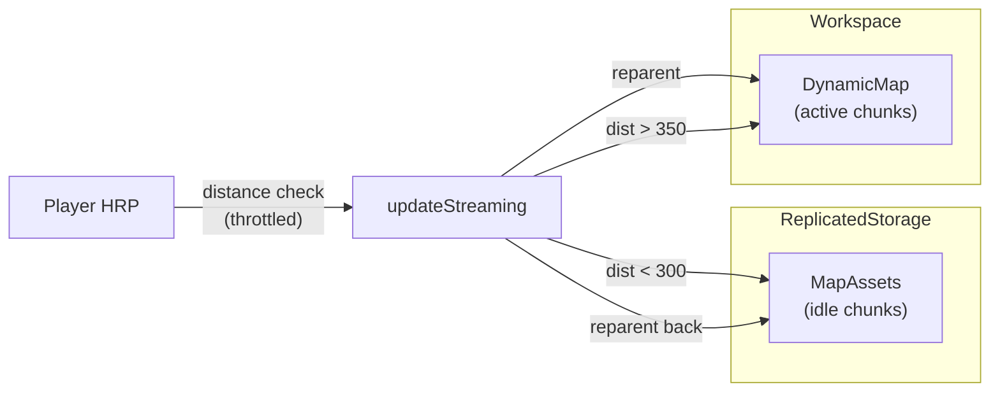

# Client-Side Map Chunk Streaming (Roblox)

A lightweight **client-side streaming system** for large Roblox worlds. Map segments stay in `ReplicatedStorage` until the player is nearby, then move into the live world via **reparenting**—no per-chunk `Clone()`, no duplicate instance trees.

Built as a portfolio-ready LocalScript you can drop into any place that already stores map chunks under `ReplicatedStorage.MapAssets`.

---

## Problem

Open-world and large-map experiences hit a wall on client devices when every chunk is parented to `Workspace` at once:

- Higher **RAM** use from duplicated or fully resident geometry
- Extra **render** and **physics** work for content the player cannot see
- Frame cost from naïve per-frame distance checks across the entire map

This module keeps **only nearby chunks** in the active world hierarchy while preserving a single Instance per chunk on the client.

---

## Approach

| Decision | Why it matters |
|----------|----------------|
| **Reparent, don’t clone** | One `Model` per chunk. Streaming toggles `Parent` between `MapAssets` and `DynamicMap` instead of allocating clone trees. |
| **Dual radius (hysteresis)** | Load inside **300** studs; unload beyond **350**. Stops rapid load/unload flicker at the boundary. |
| **Throttled updates** | Logic runs on `Heartbeat` but work is gated to **0.5s** intervals—cheap early-out, less CPU than scanning the full map every frame. |
| **`loadedChunks` + `nil` on unload** | Tracks active streamed chunks only. Clearing entries avoids unbounded Lua table growth (script-side leak) while Instances remain in the `chunks` registry. |
| **`--!strict`** | Catches bad refs and table misuse during iteration and registry updates. |

---

## How it works



1. **Stream in** — For each registered chunk, if distance to `HumanoidRootPart` &lt; `RENDER_RADIUS`, set `Parent = Workspace.DynamicMap` and store in `loadedChunks`.
2. **Stream out** — For each entry in `loadedChunks`, if distance &gt; `UNLOAD_RADIUS`, set `Parent = MapAssets` and set `loadedChunks[name] = nil`.
3. **Lifecycle** — `MapAssets` child added/removed updates the chunk registry; respawn resets the throttle and runs one immediate pass.

---

## Project structure

```
RenderingScript/
├── README.md
└── StarterPlayerScripts/
    └── MapChunkRenderer.client.luau   # LocalScript source
```

---

## Setup (Roblox Studio)

1. Copy `MapChunkRenderer.client.luau` into **StarterPlayerScripts** as a **LocalScript** (name it `MapChunkRenderer` or keep the filename).
2. Under **ReplicatedStorage**, create a **Folder** named `MapAssets`.
3. Place each map segment as a **Model** child of `MapAssets` (world position via pivot / parts as you normally build).
4. Play test. On start you should see:

   ```
   [ChunkRenderer] running — N chunks, load<300 unload>350
   ```

`Workspace.DynamicMap` is created automatically if it does not exist.

---

## Configuration

Edit the constants at the top of the script:

| Constant | Default | Description |
|----------|---------|-------------|
| `RENDER_RADIUS` | `300` | Stream-in distance (studs) |
| `STREAM_OUT_BUFFER` | `50` | Added to render radius for stream-out (hysteresis) |
| `CHECK_INTERVAL` | `0.5` | Minimum seconds between streaming passes |

Unload radius is `RENDER_RADIUS + STREAM_OUT_BUFFER` (350 by default).

---

## Requirements & assumptions

- **Client-only** — Runs under `StarterPlayerScripts`; no server authority over which chunks are loaded (suitable for visual/world streaming, not anti-cheat or gameplay state).
- Chunks are **Models** under `ReplicatedStorage.MapAssets`.
- Player character uses a standard **HumanoidRootPart**.
- Distance uses `Model:GetPivot().Position` and `.Magnitude`.

For production games, pair this with server-side validation, content ownership rules, and Roblox **StreamingEnabled** where appropriate—this script focuses on **client memory and hierarchy discipline**.

---

## Skills demonstrated

- Client performance awareness (throttling, hysteresis, avoiding clones)
- Luau strict typing and defensive nil checks around character/HRP
- Instance lifecycle and reference management on the Luau heap
- Readable, maintainable structure suitable for team review

---

## License

Use freely for learning, portfolio, and project integration. Attribution appreciated if you showcase the repo publicly.
