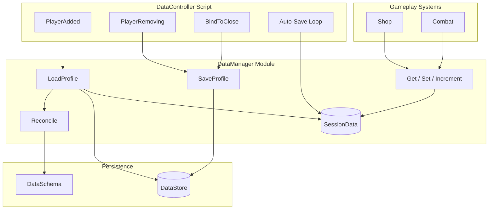

# Roblox Player Data Framework

A production-oriented **server-side data layer** for Roblox experiences, written in **strict Luau**. This repository is portfolio source code — it is not tied to a `.rbxl` place file, but mirrors how the modules would be organized in a live game (`ServerStorage` + `ServerScriptService`).

---

## Why this exists

Player data is one of the highest-risk areas in Roblox development. A weak pipeline leads to **lost progress**, **duplicate items**, **schema breakage after updates**, and **race conditions** when multiple servers write at once. This project demonstrates how to treat persistence as **infrastructure**: typed schemas, session caching, safe APIs, and shutdown-aware saves — not ad-hoc `SetAsync` calls scattered across gameplay scripts.

---

## What it does

| Concern | Solution |
|--------|----------|
| **Schema versioning** | `DataSchema` defines defaults; `Reconcile()` merges old saves with new fields |
| **Session cache** | In-memory `SessionData` per player — fast reads, no DataStore spam |
| **Race-safe writes** | `UpdateAsync` only (never `SetAsync` for player saves) |
| **Load failures** | Failed `GetAsync` → player kicked with a safe message (no silent corrupt defaults) |
| **Memory safety** | `SaveProfile` clears session refs; `ReleasePlayer` cleans up on leave |
| **Server shutdown** | `BindToClose` saves all loaded profiles in parallel with a timeout |
| **Gameplay API** | `Get` / `Set` / `Increment` — other systems never touch the cache table |

---

## Architecture



**Separation of concerns**

- **`DataSchema`** — Single source of truth for default player data and exported types.
- **`DataManager`** — DataStore I/O, reconciliation, session cache, and the public mutation API.
- **`DataController`** — Player lifecycle and server shutdown; the only place that wires `Players` events.

---

## Project structure

```
ServerStorage/
  DataSchema.luau              # Default profile + PlayerData types

ServerScriptService/
  DataManager.luau             # Core persistence & safe API
  DataController.server.luau   # Lifecycle & BindToClose wiring
```

### Default player schema

```lua
{
    Coins = 0,
    Level = 1,
    Experience = 0,
    Inventory = {},           -- [itemId: string] = quantity: number
    Stats = {
        Kills = 0,
        Deaths = 0,
    },
}
```

---

## Public API (for gameplay scripts)

```lua
local DataManager = require(ServerScriptService.DataManager)

-- Read (tables are deep-copied — cannot mutate SessionData directly)
local coins = DataManager.Get(player, "Coins")
local kills = DataManager.Get(player, "Stats.Kills")

-- Write
DataManager.Set(player, "Level", 5)
DataManager.Increment(player, "Coins", 100)
DataManager.Increment(player, "Inventory.Potion", -1)
```

Supported paths include top-level keys (`"Coins"`), nested stats (`"Stats.Kills"`), and dynamic inventory slots (`"Inventory.Sword"`). Invalid keys and type mismatches are rejected with warnings.

---

## Lifecycle

| Event | Behavior |
|-------|----------|
| **Join** | `LoadProfile` → `GetAsync` + `Reconcile` → session cache |
| **Leave** | `ReleasePlayer` → `SaveProfile` (`UpdateAsync`) → cache cleared |
| **Every 120s** | `SaveAll` — persists without dropping active sessions |
| **Server close** | Parallel `SaveProfile` per loaded player, 30s timeout, +2s production buffer |

---

## Technical highlights (for reviewers)

- **`--!strict`** throughout, with exported types (`PlayerData`, `DataPath`, `PlayerStats`).
- **`Reconcile(data, template)`** — deep merge for nested tables; preserves extra inventory keys; fills missing schema fields after game updates.
- **Retry wrapper** — DataStore operations wrapped in `pcall` with exponential backoff (5 attempts).
- **Fail-closed loading** — DataStore errors on join do not grant a blank profile; the player is kicked to prevent overwriting real data later.
- **Encapsulation** — Gameplay code uses `Get`/`Set`/`Increment`; `SessionData` stays module-private.

---

## Integrating into a live experience

1. Add `DataSchema` as a **ModuleScript** under `ServerStorage`.
2. Add `DataManager` as a **ModuleScript** under `ServerScriptService`.
3. Add `DataController` as a **Script** (not ModuleScript) under `ServerScriptService`.
4. From shop/combat/etc., `require` **only** `DataManager` and use the safe API.

No `Init()` call is required — `DataController` boots the pipeline on server start.

---

## Skills demonstrated

- Roblox **DataStoreService** best practices (`UpdateAsync`, retries, shutdown saves)
- **Luau** type system and modular **ModuleScript** architecture
- **Defensive programming** (pcall, validation, fail-closed load, leak prevention)
- **Schema migration** pattern without third-party libraries
- Clear **client/server boundary** mindset (server-authoritative data, no cache exposure)

---

## Author note

Built as an intentional portfolio piece to show backend-style rigor on Roblox — the kind of data layer you would extend with session locking (e.g. ProfileStore), analytics, or admin tools in a production title.
