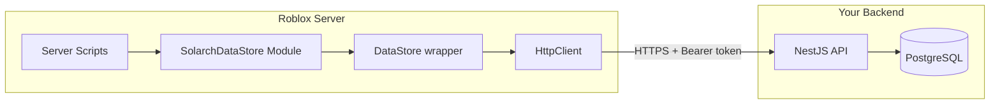

# Solarch External DataStore

A **drop-in Roblox DataStoreService replacement** that persists data through a secure HTTP backend ([Solarch](https://github.com/laothrs/myrobloxscripts) NestJS API). Written in **strict Luau**, packaged for **one-file Studio import** or manual module setup.

Use this when you need **full control** over persistence (custom encryption, audit trails, rate limits, cross-game analytics) instead of Roblox’s built-in DataStore quotas alone.

---

## Why this exists

Roblox’s native `DataStoreService` is excellent for most titles, but some experiences need:

- A **self-hosted or custom backend** with PostgreSQL, Redis, and audit logging  
- **Predictable REST APIs** for tooling, admin panels, or cross-platform sync  
- **Session-scoped auth** and encrypted blobs outside the Roblox cloud  

This module exposes the **familiar DataStore API** (`GetAsync`, `SetAsync`, `UpdateAsync`, `RemoveAsync`, `IncrementAsync`) while routing calls through `HttpService` to your backend.

---

## Quick install (drag & drop)

The fastest path — no copy-paste of individual scripts.

1. **Enable HTTP** in Roblox Studio:  
   `Game Settings → Security → Allow HTTP Requests`

2. **Import the model**  
   - Studio menu: **File → Insert from File…**  
   - Select [`dist/SolarchDataStore.rbxmx`](./dist/SolarchDataStore.rbxmx)

3. **Move the folder**  
   - Drag the imported **`SolarchDataStore`** folder into **`ServerScriptService`**

4. **Configure**  
   - Open **`ServerScriptService → SolarchDataStore → Config`** (ModuleScript)  
   - Set `Config.ApiUrl` to your backend URL (HTTPS in production)  
   - Set `Config.ApiKey` to your backend `ROBLOX_API_KEY`  
   - If testing in Studio where `game.GameId` is `0`, set `Config.StudioUniverseId`

5. **Run Play**  
   - Check **Output** for: `[SolarchDataStore] ✓ Setup OK`  
   - Fix any warnings before shipping

---

## Manual install (source files)

If you prefer version control inside Studio or Rojo sync:

1. Create a **Folder** named `SolarchDataStore` under `ServerScriptService`
2. Add **ModuleScripts** from [`ServerScriptService/`](./ServerScriptService/) (same names, paste source)
3. Add **Scripts** for `SetupValidator.server.luau` (enabled) and optionally `ExampleUsage.server.luau` (disabled by default)
4. Configure **`Config`** as above

Expected hierarchy:

```
ServerScriptService/
└── SolarchDataStore/
    ├── Config              (ModuleScript)
    ├── Errors              (ModuleScript)
    ├── HttpClient          (ModuleScript)
    ├── DataStore           (ModuleScript)
    ├── SolarchDataStore    (ModuleScript)  ← entry point
    ├── SetupValidator      (Script)
    ├── ExampleUsage        (Script, disabled)
    └── InstallGuide        (Script, disabled — in-studio docs)
```

---

## Usage

```lua
local DataStoreService = require(
    game.ServerScriptService.SolarchDataStore.SolarchDataStore
)

local store = DataStoreService:GetDataStore("PlayerData")

-- Same API as native DataStoreService
store:SetAsync("profile_" .. player.UserId, { Coins = 100, Level = 1 })

local profile = store:GetAsync("profile_" .. player.UserId)

store:UpdateAsync("profile_" .. player.UserId, function(old)
    local data = old or { Coins = 0, Level = 1 }
    data.Coins += 50
    return data
end)

store:IncrementAsync("server_visits", 1)
store:RemoveAsync("temp_flag_" .. player.UserId)
```

Wrap calls in `pcall` in production — errors surface as readable strings (`[SolarchDataStore:AuthError]`, etc.).

---

## Backend requirement

This client module expects a running **Solarch DataStore API** with these endpoints:

| Method | Path | Purpose |
|--------|------|---------|
| `POST` | `/api/v2/session` | Issue session token (`x-api-key` header) |
| `GET` | `/api/v2/datastore/:scope/:key` | Read entry |
| `POST` | `/api/v2/datastore/:scope/:key` | Create / overwrite |
| `PUT` | `/api/v2/datastore/:scope/:key` | Atomic update |
| `DELETE` | `/api/v2/datastore/:scope/:key` | Soft delete |
| `POST` | `/api/v2/datastore/:scope/:key/increment` | Numeric increment |

Backend setup (separate repo / server):

```bash
cp .env.example .env   # set DATABASE_URL, ROBLOX_API_KEY, etc.
npm install
npm run db:migrate
npm start
```

---

## Architecture



**Module responsibilities**

| Module | Role |
|--------|------|
| **`Config`** | Only file you edit — URL, API key, retries, Studio universe ID |
| **`HttpClient`** | Session tokens, retries, 401 refresh, 429/5xx backoff |
| **`DataStore`** | Per-store cache, version tracking, Roblox-compatible method surface |
| **`Errors`** | Typed error categories for `pcall` handling |
| **`SolarchDataStore`** | Factory: `GetDataStore`, `GetGlobalDataStore`, `RefreshSession` |
| **`SetupValidator`** | Boot-time config + connectivity check |

---

## Features

| Feature | Detail |
|---------|--------|
| **One-file import** | `dist/SolarchDataStore.rbxmx` — drag into Studio |
| **Native-like API** | Drop-in `GetDataStore` / `GetAsync` / `UpdateAsync` |
| **Session auth** | Short-lived tokens; API key never sent on data routes |
| **Retries** | Configurable backoff; auto refresh on 401 |
| **Optimistic concurrency** | Version headers on write paths |
| **Cache** | Per-key session cache (handles `false` / `0` correctly) |
| **Strict typing** | `--!strict` throughout |
| **Studio-safe** | `StudioUniverseId` when `game.GameId == 0` |

---

## Configuration reference

```lua
Config.ApiUrl = "https://api.yourgame.com"
Config.ApiKey = "your-roblox-api-key"
Config.UniverseId = nil              -- optional override
Config.StudioUniverseId = 1234567  -- Studio testing
Config.DefaultScope = "global"
Config.MaxRetries = 3
Config.RetryBaseDelay = 0.5
Config.Debug = true
Config.RunSetupValidator = true
```

---

## Pair with DataManaging

This repo also includes [**DataManaging**](../DataManaging/) — a **native DataStore** player profile framework with schema reconciliation and `BindToClose` saves.

| Approach | Best for |
|----------|----------|
| **DataManaging** | Standard Roblox persistence, ProfileStore-style patterns |
| **SolarchDataStore** | Custom backend, encryption, external tooling |

You can wrap Solarch stores inside a `DataManager`-style layer for typed player profiles.

---

## Technical highlights

- Keys namespaced as `{datastoreName}/{key}` — matches Roblox multi-store conventions  
- `UpdateAsync` aborts when transform returns `nil` (Roblox semantics)  
- `BindToClose` example in `ExampleUsage.server.luau`  
- No client access — server-only `HttpService` calls  
- Production checklist: HTTPS, secret API keys, rate limits on backend  

---

## Rebuilding the `.rbxmx`

If you modify sources in the Solarch backend monorepo:

```bash
npm run build:roblox
# Output: roblox/dist/SolarchDataStore.rbxmx
```

Copy the rebuilt file into this folder’s `dist/` before committing.

---

## License

Free to use for learning and integration. Credit appreciated if you showcase this repository publicly.
